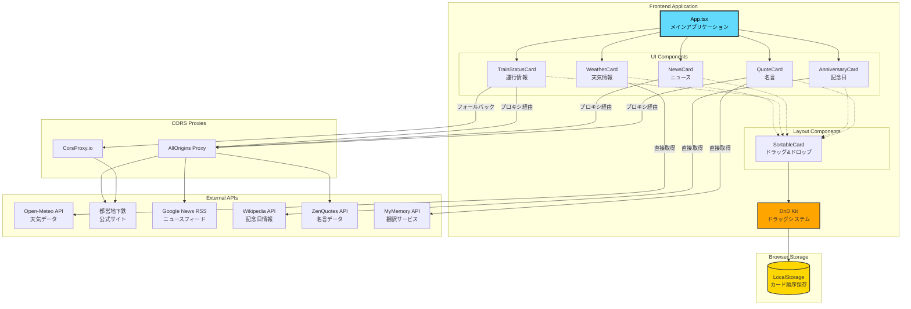

# 朝のダッシュボード 🌅

毎朝快適にスタートするための情報ダッシュボードです。天気、運行状況、ニュース、名言など、朝に必要な情報を一画面で確認できます。


## 🎯 コンセプト

朝の限られた時間の中で、必要な情報を一箇所で効率よく確認できるダッシュボードアプリケーションです。複数のアプリを開く手間を省き、快適な朝のスタートをサポートします。

## ✨ 機能

### 情報カード
- ☀️ **天気情報**: Open-Meteo APIを使用した詳細な天気予報
  - 現在の気温・天気状態
  - 今日の気温変化グラフ（3時間おき）
  - 降水量・風速・湿度の表示
  - 10分ごとに自動更新

- 🚇 **都営浅草線運行情報**: 東京都交通局公式サイトから運行状況を取得
  - リアルタイムの運行状態
  - 遅延・運転見合わせの通知
  - 5分ごとに自動更新

- 📰 **Google ニュース**: 主要ニュースの最新5件をRSSから取得
  - 相対時刻表示（○分前、○時間前）
  - ニュースソースの表示
  - 外部リンクへのワンクリックアクセス
  - 15分ごとに自動更新

- 🎯 **今日は何の日**: Wikipedia APIから日本の記念日情報を表示
  - 今日の記念日・歴史的出来事
  - フォールバック用の記念日データベース内蔵

- 💭 **偉人の言葉**: ZenQuotes APIから名言を取得し日本語翻訳で表示
  - 英語原文と日本語訳を同時表示
  - リフレッシュボタンで別の名言を取得
  - MyMemory Translation APIによる翻訳

### UI/UX機能
- 🔄 **ドラッグ&ドロップ**: カードの順序を自由に変更可能
  - @dnd-kitによる滑らかなドラッグ操作
  - LocalStorageで順序を永続化
  - ホバー時にドラッグハンドルを表示

- 🌙 **ダークモード対応**: システム設定を自動検出し、手動での切り替えも可能
  - OS設定に応じた自動切り替え
  - グラフやアイコンもダークモード対応
  - スムーズなトランジション

- 🖼️ **背景画像カスタマイズ**: 毎日変わる美しい背景画像
  - Picsum Photosによるランダム画像（デフォルト）
  - Unsplash API対応（オプション）
  - 日付ベースのキャッシュ機能
  - オン/オフ切り替え可能

- 📱 **レスポンシブデザイン**: モバイルファーストで設計された美しいUI
  - タブレット・スマートフォンに最適化
  - 2カラムのグリッドレイアウト
  - タッチ操作対応

## 🏗️ アーキテクチャ



## 🛠️ 技術スタック

### フロントエンド
- **フレームワーク**: React 19.2.3 + TypeScript 5.9.3
- **ビルドツール**: Vite 7.3.1
- **スタイリング**: Tailwind CSS v4.1.18 (PostCSS)
- **ドラッグ&ドロップ**: @dnd-kit 6.3.1 (core, sortable, utilities)
- **グラフ描画**: Recharts 3.6.0
- **アイコン**: Lucide React 0.562.0
- **HTTPクライアント**: Axios 1.13.2
- **フォント**: Crimson Pro（見出し）、Noto Sans JP（本文）

### API連携
- **天気**: [Open-Meteo API](https://open-meteo.com/) (無料、APIキー不要)
- **運行情報**: 東京都交通局公式サイト (HTMLスクレイピング)
- **ニュース**: Google News RSS (CORSプロキシ経由)
- **記念日**: Wikipedia API 日本語版
- **名言**: ZenQuotes API (CORSプロキシ経由)
- **翻訳**: MyMemory Translation API

### CORSプロキシ
- [AllOrigins](https://api.allorigins.win/) (プライマリ)
- [CorsProxy.io](https://corsproxy.io/) (フォールバック)

## 📂 プロジェクト構造

```
morning-dashboard/
├── src/
│   ├── components/           # Reactコンポーネント
│   │   ├── WeatherCard.tsx         # 天気情報カード（Rechartsグラフ統合）
│   │   ├── TrainStatusCard.tsx     # 運行情報カード（HTMLパース）
│   │   ├── NewsCard.tsx            # ニュースカード（RSS解析）
│   │   ├── AnniversaryCard.tsx     # 記念日カード（Wikipedia API）
│   │   ├── QuoteCard.tsx           # 名言カード（翻訳機能付き）
│   │   └── SortableCard.tsx        # ドラッグ可能ラッパー
│   ├── hooks/                # カスタムReactフック
│   │   └── useBackgroundImage.ts   # 背景画像管理フック
│   ├── App.tsx                     # メインアプリケーション
│   ├── main.tsx                    # エントリーポイント
│   └── index.css                   # グローバルスタイル
├── dist/                     # ビルド出力（自動生成）
├── index.html                # HTMLテンプレート
├── vite.config.ts            # Vite設定（GitHub Pages対応）
├── postcss.config.js         # PostCSS設定
├── tsconfig.json             # TypeScript設定
├── package.json              # 依存関係とスクリプト
├── CLAUDE.md                 # プロジェクト開発ルール
├── REVIEW.md                 # コードレビュー結果
├── FEATURE_PROPOSALS.md      # 機能追加提案
├── CONTRIBUTING.md           # 開発ガイドライン
├── API.md                    # API仕様書
└── CHANGELOG.md              # 変更履歴
```

## 🚀 セットアップ

### 必要な環境

- Node.js 18 以上
- npm または yarn

### インストール

```bash
# リポジトリをクローン
git clone https://github.com/kunya-oba/morning-dashboard.git
cd morning-dashboard

# 依存関係をインストール
npm install
```

### 開発サーバーの起動

```bash
npm run dev
```

ブラウザで `http://localhost:5173/morning-dashboard/` にアクセスしてください。

### ビルド

```bash
npm run build
```

ビルドされたファイルは `dist` ディレクトリに出力されます。

### プレビュー

```bash
npm run preview
```

ビルドしたファイルをローカルでプレビューできます。

## 🌐 GitHub Pages へのデプロイ

このプロジェクトは GitHub Pages へのデプロイを想定して設定されています。

### 自動デプロイ（推奨）

GitHub Actions を使用した自動デプロイを設定することを推奨します。

### 手動デプロイ

```bash
# gh-pages パッケージをインストール（初回のみ）
npm install -D gh-pages

# デプロイスクリプトを package.json に追加
# "deploy": "npm run build && gh-pages -d dist"

# デプロイ実行
npm run deploy
```

デプロイ後、`https://[ユーザー名].github.io/morning-dashboard/` でアクセスできます。

## 🎨 カスタマイズ

### カードの順序変更

各カードの左側に表示されるドラッグハンドル（三本線アイコン）をドラッグすることで、カードの順序を自由に変更できます。順序はLocalStorageに保存され、ページをリロードしても維持されます。

### スタイリング

- `src/index.css`: グローバルスタイルとTailwind CSSのカスタムテーマ
- カラースキーム、フォントなどは `@theme` ブロックで設定可能

```css
@theme {
  --font-display: "Crimson Pro", serif;
  --font-sans: "Noto Sans JP", sans-serif;
}
```

### ダークモード

ダークモードは自動的にシステム設定を検出します。UIの右上のボタンで手動切り替えも可能です。

### 背景画像

右上の画像アイコンをクリックすることで、背景画像のオン/オフを切り替えられます。

デフォルトでは **Picsum Photos** からランダムな画像を表示します。より美しい朝の風景画像を表示したい場合は、Unsplash APIキーを設定してください：

1. [Unsplash Developers](https://unsplash.com/developers) でアカウント作成
2. アプリケーションを作成してAccess Keyを取得（無料プランで月5000リクエスト）
3. プロジェクトルートに `.env` ファイルを作成：

```bash
VITE_UNSPLASH_ACCESS_KEY=your_access_key_here
```

4. 開発サーバーを再起動

### 地域設定

天気情報の地域を変更するには、`src/components/WeatherCard.tsx` の緯度経度を変更してください：

```typescript
const latitude = 35.6762;  // 東京の緯度
const longitude = 139.6503; // 東京の経度
```

## 🔧 トラブルシューティング

### CORSエラーが発生する場合

一部のAPIはCORS制限があるため、プロキシサービス経由でアクセスしています。プロキシサービスが利用できない場合は、代替プロキシに切り替えるか、バックエンドサーバーを立てる必要があります。

### データが取得できない場合

- ブラウザの開発者ツールでコンソールログを確認してください
- 各APIサービスの稼働状況を確認してください
- 5分ごとに自動更新されるため、しばらく待つと復旧する場合があります

## 📝 今後の拡張アイデア

詳細は [FEATURE_PROPOSALS.md](./FEATURE_PROPOSALS.md) を参照してください。

### 優先度: 高
- [ ] TODOリスト / タスク管理カード
- [ ] 時計・タイマーカード（ポモドーロタイマー）
- [ ] モーニングルーティーンチェックリスト

### 優先度: 中
- [ ] 複数路線の運行情報対応
- [ ] 天気アラート・通知機能
- [ ] 位置情報のカスタマイズ
- [ ] ニュースのカテゴリフィルター

### 優先度: 低
- [ ] カレンダー・スケジュール統合（Google Calendar）
- [ ] 通勤経路・交通情報（Google Maps API）
- [ ] 為替・株価情報カード
- [ ] PWA対応（オフライン機能）

## 🐛 既知の問題と改善点

詳細は [REVIEW.md](./REVIEW.md) を参照してください。

### 重要度: 高
- 環境変数の適切な管理（Unsplash APIキー）
- ダークモード切り替え時のグラフ色更新
- API応答の型定義不足

### 重要度: 中
- console.logの残存（本番環境での除去）
- エラー境界（Error Boundary）の実装
- 非同期処理のクリーンアップ改善

## 📚 ドキュメント

- [CLAUDE.md](./CLAUDE.md) - プロジェクト開発ルール
- [REVIEW.md](./REVIEW.md) - コードレビュー結果
- [FEATURE_PROPOSALS.md](./FEATURE_PROPOSALS.md) - 機能追加提案
- [CONTRIBUTING.md](./CONTRIBUTING.md) - 開発ガイドライン
- [API.md](./API.md) - API仕様書
- [CHANGELOG.md](./CHANGELOG.md) - 変更履歴

## 📄 ライセンス

ISC

## 👤 作成者

kunya-oba

---

**朝を気持ちよくスタートしましょう！** ☕️✨
