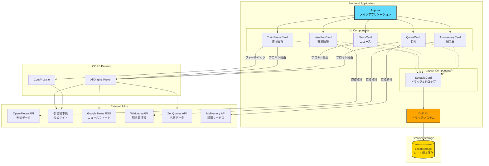

# 朝のダッシュボード 🌅

毎朝快適にスタートするための情報ダッシュボードです。天気、運行状況、ニュース、名言など、朝に必要な情報を一画面で確認できます。


## ✨ 機能

- ☀️ **天気情報**: Open-Meteo API を使用した東京の天気予報・気温・降水確率
- 🚇 **都営浅草線運行情報**: 東京都交通局公式サイトから運行状況を取得・表示
- 📰 **Google ニュース**: 主要ニュースの最新5件をRSSから取得
- 🎯 **今日は何の日**: Wikipedia APIから日本の記念日情報を表示
- 💭 **偉人の言葉**: ZenQuotes APIから名言を取得し日本語翻訳で表示
- 🔄 **ドラッグ&ドロップ**: カードの順序を自由に変更可能（LocalStorageに保存）
- 🌙 **ダークモード対応**: システム設定を自動検出し、手動での切り替えも可能
- 📱 **レスポンシブデザイン**: モバイルファーストで設計された美しいUI

## 🏗️ アーキテクチャ



## 🛠️ 技術スタック

### フロントエンド
- **フレームワーク**: React 19 + TypeScript
- **ビルドツール**: Vite 7
- **スタイリング**: Tailwind CSS v4 (PostCSS)
- **ドラッグ&ドロップ**: @dnd-kit (core, sortable, utilities)
- **アイコン**: Lucide React
- **HTTP クライアント**: Axios
- **フォント**: Crimson Pro（見出し）、Noto Sans JP（本文）

### API連携
- **天気**: [Open-Meteo API](https://open-meteo.com/) (無料、APIキー不要)
- **運行情報**: 東京都交通局公式サイト (HTMLスクレイピング)
- **ニュース**: Google News RSS (CORSプロキシ経由)
- **記念日**: Wikipedia API 日本語版
- **名言**: ZenQuotes API (CORSプロキシ経由)
- **翻訳**: MyMemory Translation API

### CORSプロキシ
- [AllOrigins](https://api.allorigins.win/) (プライマリ)
- [CorsProxy.io](https://corsproxy.io/) (フォールバック)

## 📂 プロジェクト構造

```
morning-dashboard/
├── src/
│   ├── components/
│   │   ├── WeatherCard.tsx         # 天気情報カード
│   │   ├── TrainStatusCard.tsx     # 運行情報カード
│   │   ├── NewsCard.tsx            # ニュースカード
│   │   ├── AnniversaryCard.tsx     # 記念日カード
│   │   ├── QuoteCard.tsx           # 名言カード
│   │   └── SortableCard.tsx        # ドラッグ可能ラッパー
│   ├── App.tsx                     # メインアプリケーション
│   ├── main.tsx                    # エントリーポイント
│   └── index.css                   # グローバルスタイル
├── index.html                      # HTML テンプレート
├── vite.config.ts                  # Vite 設定
├── postcss.config.js               # PostCSS 設定
├── tsconfig.json                   # TypeScript 設定
├── CLAUDE.md                       # プロジェクト開発ルール
└── package.json                    # 依存関係
```

## 🚀 セットアップ

### 必要な環境

- Node.js 18 以上
- npm または yarn

### インストール

```bash
# リポジトリをクローン
git clone https://github.com/kunya-oba/morning-dashboard.git
cd morning-dashboard

# 依存関係をインストール
npm install
```

### 開発サーバーの起動

```bash
npm run dev
```

ブラウザで `http://localhost:5173/morning-dashboard/` にアクセスしてください。

### ビルド

```bash
npm run build
```

ビルドされたファイルは `dist` ディレクトリに出力されます。

### プレビュー

```bash
npm run preview
```

ビルドしたファイルをローカルでプレビューできます。

## 🌐 GitHub Pages へのデプロイ

このプロジェクトは GitHub Pages へのデプロイを想定して設定されています。

### 自動デプロイ（推奨）

GitHub Actions を使用した自動デプロイを設定することを推奨します。

### 手動デプロイ

```bash
# gh-pages パッケージをインストール（初回のみ）
npm install -D gh-pages

# デプロイスクリプトを package.json に追加
# "deploy": "npm run build && gh-pages -d dist"

# デプロイ実行
npm run deploy
```

デプロイ後、`https://[ユーザー名].github.io/morning-dashboard/` でアクセスできます。

## 🎨 カスタマイズ

### カードの順序変更

各カードの左側に表示されるドラッグハンドル（三本線アイコン）をドラッグすることで、カードの順序を自由に変更できます。順序はLocalStorageに保存され、ページをリロードしても維持されます。

### スタイリング

- `src/index.css`: グローバルスタイルとTailwind CSSのカスタムテーマ
- カラースキーム、フォントなどは `@theme` ブロックで設定可能

```css
@theme {
  --font-display: "Crimson Pro", serif;
  --font-sans: "Noto Sans JP", sans-serif;
}
```

### ダークモード

ダークモードは自動的にシステム設定を検出します。UIの右上のボタンで手動切り替えも可能です。

### 背景画像

右上の画像アイコンをクリックすることで、背景画像のオン/オフを切り替えられます。

デフォルトでは **Picsum Photos** からランダムな画像を表示します。より美しい朝の風景画像を表示したい場合は、Unsplash APIキーを設定してください：

1. [Unsplash Developers](https://unsplash.com/developers) でアカウント作成
2. アプリケーションを作成してAccess Keyを取得（無料プランで月5000リクエスト）
3. プロジェクトルートに `.env` ファイルを作成：

```bash
VITE_UNSPLASH_ACCESS_KEY=your_access_key_here
```

4. 開発サーバーを再起動

### 地域設定

天気情報の地域を変更するには、`src/components/WeatherCard.tsx` の緯度経度を変更してください：

```typescript
const latitude = 35.6762;  // 東京の緯度
const longitude = 139.6503; // 東京の経度
```

## 🔧 トラブルシューティング

### CORSエラーが発生する場合

一部のAPIはCORS制限があるため、プロキシサービス経由でアクセスしています。プロキシサービスが利用できない場合は、代替プロキシに切り替えるか、バックエンドサーバーを立てる必要があります。

### データが取得できない場合

- ブラウザの開発者ツールでコンソールログを確認してください
- 各APIサービスの稼働状況を確認してください
- 5分ごとに自動更新されるため、しばらく待つと復旧する場合があります

## 📝 今後の拡張アイデア

- [ ] カード表示/非表示の切り替え機能
- [ ] 朝の習慣チェックリスト
- [ ] 服装提案機能（気温連動）
- [ ] Google Calendar連携
- [ ] 通勤時刻逆算機能
- [ ] 背景画像カスタマイズ（Unsplash API）

## 📄 ライセンス

ISC

## 👤 作成者

kunya-oba

---

**朝を気持ちよくスタートしましょう！** ☕️✨
